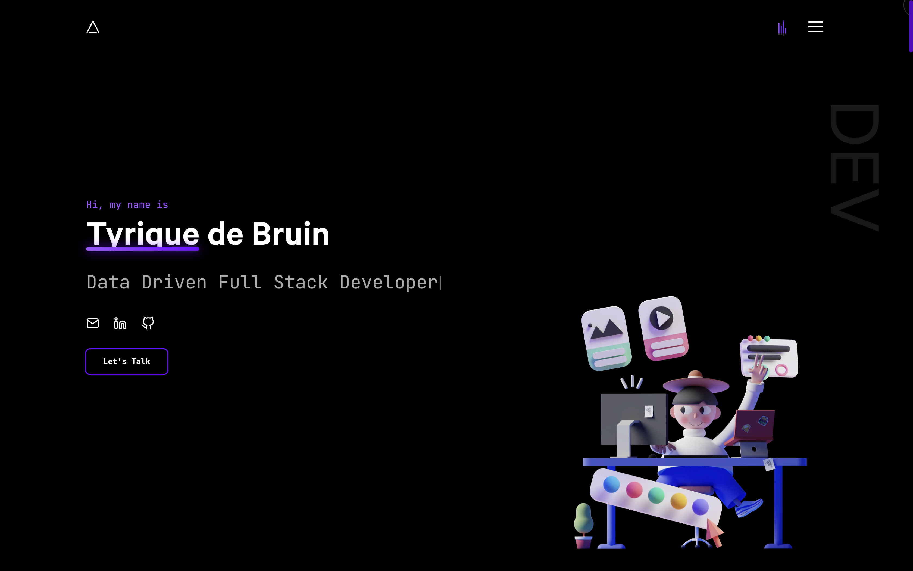

# Personal Portfolio – Tyrique de Bruin

  
  
  

🎯 A clean, animated developer portfolio built with **Next.js**, **GSAP**, **Tailwind CSS**, and **React** — customized by [Tyrique de Bruin](mailto:tyriquedebruin@gmail.com).
